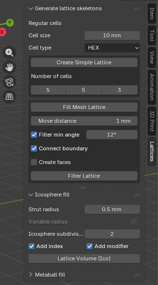
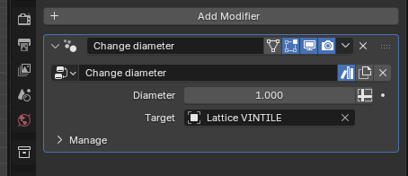

# Lattesh
## A lattice add-on for [Blender](https://www.blender.org/)

Lattices structures offer several advantages like weight reduction and adjustable mechanical properties.
To use this potential, one needs design tools to generate these structures, which are, then, 3D printed.

*Lattesh* aims to provide tools for the creation of lattices in an open source package. 


## Install instructions
Download the zip file. The add-on is still in the legacy, pre-4.2 format. 

Go to Edit -> Preferences -> Add-ons -> Install from disk (down arrow on the upper right corner) and select the zip file.

Some functionalities require the Scipy Python package. This should be installed in the python distribution that comes with Blender. 

Open a terminal, go to where the Python from Blender is and run

```
python -m pip install scipy
```

## Quick usage



Generate a form-filling lattice in two steps:
  1. Generate a lattice skeleton
     - select the target object
     - choose the cell size and type
     - click `Fill mesh lattice` (may take a while)
  2. Generate the lattice
	 - select the lattice skeleton
	 - click `Lattice Volume (Ico)` (will take a while)
	 - adjust the beams's diameter in the modifier

## Usage
First some tips. The add-on does some heavy computations. While computing, Blender will stop responding to events and will appear as it has frozen. To be able to see progress, and to interrupt it if needed, you will need to see the terminal. So start Blender from a terminal or open one later. 

Doing CTR-c on the terminal will interrupt a long computation. Also, the computation progress will be written to the terminal, so it is possible to see how much there is still to be done, along with some other useful data.

The main intended purpose of the lattice structures here is to be 3D printed. Therefore, the default dimensions in the add-on are tuned to this. For instance, the default beam thickness is 1 unit and the default cell size is 10 units. This is a reasonable choice if when Blender is set up with millimeters for units, but not so much when the default unit in Blender, meter, is used. 

For better results, configure Blender to use millimeters. This is a good practice when using Blender for 3D printing anyway. Go to `Scene` in the properties panel and set `Length` to Millimeters and `Unit Scale` to `0.001`. It might be useful to adjust the `Scale` of the grid in the `Overlays` to `0.01` to have a more reasonable grid floor in the viewport. 

### Lattice anatomy
_Lattesh_ represents lattice structures using meshes in Blender. These are named just _lattices_ from now on in this text. They are not to be confounded with the lattice object used in the `Lattice Modifier`. 

Conceptually, a lattice in _Lattesh_ is a structure composed of _beams_ or _struts_ with circular cross section that connect at a spherical _node_. _Lattesh_ is particular adapted to create lattices composed of a repeating cubic _cell_ that fills up some volume, that is, a _regular_ lattice. However, _Lattesh_ can process lattices made of any arrangement of struts, to a certain point.

There are many possibilities for the cells. They are referred to as the cell _type_. _Lattesh_ comes with a selection of cell types. Another important parameter is the cell _size_, the length of the edge of the cube of the repeating cell. Together, cell type and size define the topology of the lattice _Lattesh_ will create. 

### Lattice Skeletons
Lattices are represented in _Lattesh_ using two concepts, a lattice _skeleton_ and a proper, printable lattice. Both are stored as regular Blender meshes, and they can be edited using the standard Blender editing tools. 

A lattice skeleton contains only the lattice topology, that is, the positions of the nodes and the beams connecting them. In Blender, it is a mesh containing only vertices and edges. It does not have any faces and it is not directly 3d-printable. Once a skeleton is created using the tools below, it can be edited as any Blender mesh. This allows for the adjustment of the created lattice. 

_Lattesh_ provides two main tools to create lattice skeletons. In all of these tools, the `Cell size` and `Cell type` control the generated cells. 


`Create Simple Lattice` is a simple lattice skeleton generation tool. It creates a lattice by repeating the cell a number of times in each direction. For instance, when `Number of cells` is 5, 5, 3, it will create a lattice skeleton with 5 cell in the _x_ direction, 5 in the _y_, and 3 in the _z_. 

`Fill mesh lattice` is a more useful tool. It will fill up the active object with a lattice skeleton defined the `Cell size` and `Cell type` parameters, cutting the lattice to adapt it to the object borders. This tool will likely take some time to process, during which Blender will stop responding. Check the terminal to follow the progress. The active object has to be a mesh for the tool to be enabled. And it should define a proper volume (it should be manifold).

This tool has some parameters of its own. `Move distance` will move a node that is up to this distance from the target mesh surface to said surface. This may slightly deform cells that are on the boundary but will minimize the creation of very short struts and may create more aesthetic lattices. 

`Filter min angle` will remove struts that form an angle with another strut that is less than the parameter. This prevents problems with the next step that transforms a skeleton to an actual, printable lattice.

When filling up a volume with a lattice skeleton, the cells that are on the boundary are cut to follow the surface. This creates a large number of dangling struts close to the surface of the target mesh. `Connect boundary` will connect these dangling border struts. This option is only available for selected cell types. 

`Create faces` will generate an extra mesh similar to the target mesh volume. Its faces are aligned with the boundary cells, which can be useful in design. This option is likewise only available for selected cell.

### From skeletons to lattices
`Lattice Volume (Ico)` will take a lattice skeleton (the active object, which must be a mesh) and generate a lattice mesh where there will be a beam for each edge in the skeleton. This is a proper, printable lattice structure. This is similar to the skin modifier, but is significantly faster for larger skeletons, and the created mesh has less faces and is manifold.

The tool parameters should be left at their default values. 

Like the previous tool, this one can take a while to compute, freezing Blender until it has finished. The progress is informed in the terminal. 

#### Setting strut diameter
The topology of the created lattice mash allows the easy changing of the struts's diameter. Per default, the `Lattice Volume (Ico)` tool adds a geometry nodes modifier to the created lattice. This modifier changes the diameter of all the lattice struts. It uses the original lattice skeleton, so if that skeleton is modified, it will cause problems. Changing the diameters is _very_ fast.

While this modifier sets all diameter to the same value, the lattice mesh topology allows for a different diameter on each node. The GN modifier can be used as basis to write other modifiers that take a field of values to set the diameter on each node.



## About
### cirp GmbH
*Lattesh* is developed by [cirp GmbH](https://www.cirp.de).

**cirp** is a service provider for the production of prototypes and small-run series (including additive manufacturing) located in south Germany. 

All examples shown here were printed at **cirp**.

### MOAMMM
*Lattesh* is developed in the context of [MOAMMM](https://www.moammm.eu), a research project in the context of FET Open – Novel ideas for radically new technologies;
part of the European Innovation Council pilot and also known as EIC Pathfinder. 

<table>
 <tr>
  <td></td> 
  <td>This project has received funding from the European Union's Horizon 2020 research and innovation programme under grant agreement No 862015. <br />
  Views and opinions expressed are however those of the author(s) only and do not necessarily reflect those of the European Union. Neither the European Union nor the granting authority can be held responsible for them.</td>
 </tr>
</table>
