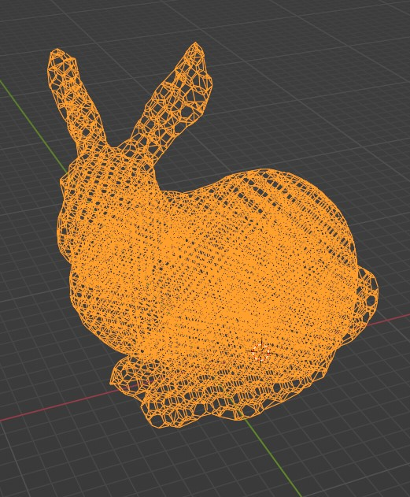
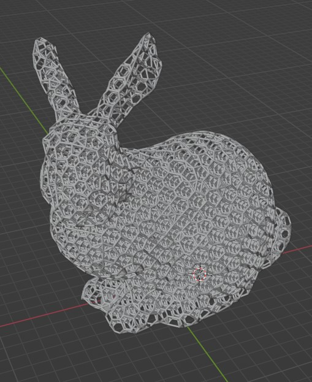
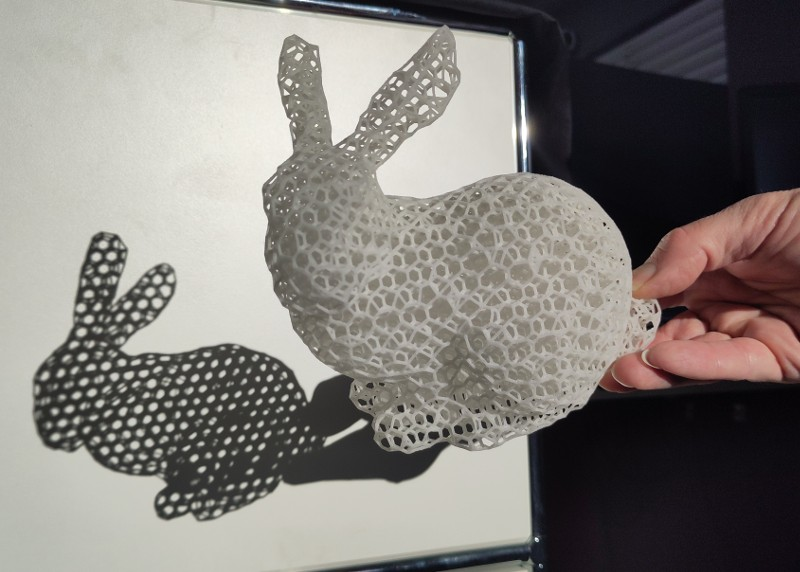

# Lattesh
## A lattice add-on for [Blender](https://www.blender.org/)

Lattices structures offer several advantages like weight reduction and and adjustable mechanical properties.
To use this potential, one needs design tools to generate these structures, which are, then 3D printed.

*Lattesh* aims to provide tools for the creation of lattices in an open source package. 

## Instructions

 - Install instructions [here](doc/INSTALL.md).
 - Brief usage instructions [here](doc/USAGE.md)

## About
### cirp GmbH
*Lattesh* is developed by [cirp GmbH](https://www.cirp.de).

**cirp** is a service provider for the production of prototypes and small-run series (including additive manufacturing) located in south Germany. 

All examples shown here were printed at **cirp**.

### MOAMMM
*Lattesh* is developed in the context of [MOAMMM](https://www.moammm.eu), a research project in the context of FET Open – Novel ideas for radically new technologies;
part of the European Innovation Council pilot and also known as EIC Pathfinder. 

 -  This project has received funding from the European Union's Horizon 2020 research and innovation programme under grant agreement No 862015. 

   Views and opinions expressed are however those of the author(s) only and do not necessarily reflect those of the European Union. Neither the European Union nor the granting authority can be held responsible for them. 
